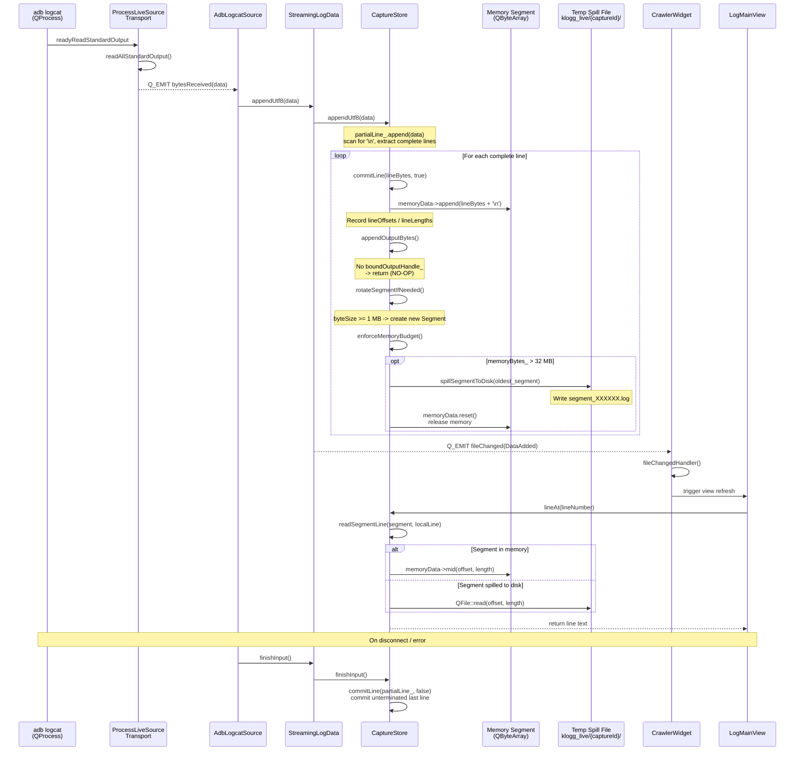
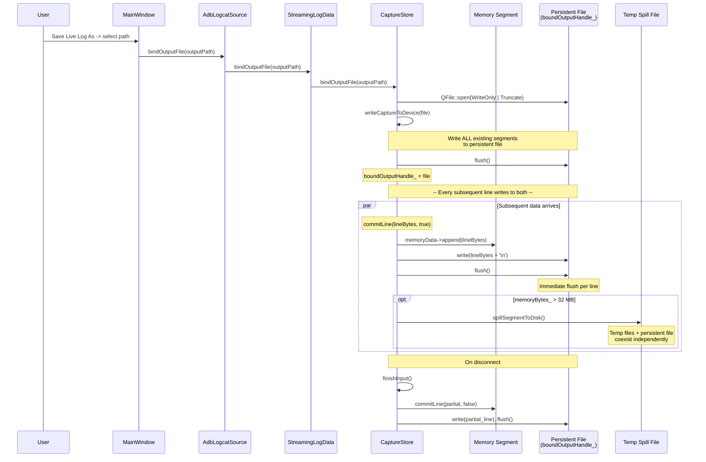

# ADB Logcat Live Source Architecture

This document describes the data flow for ADB logcat live sources in klogg,
covering both the default memory/temp-file mode and the "Save Live Log As"
persistent-file mode.

## Overview

```
adb logcat (QProcess stdout)
  -> ProcessLiveSourceTransport::bytesReceived
  -> AdbLogcatSource -> StreamingLogData::appendUtf8()
  -> CaptureStore::appendUtf8() -> commitLine()
    -> Memory segment (Segment.memoryData)
    -> When memoryBytes_ > 32 MB: spillSegmentToDisk()
    -> If bound output file: appendOutputBytes() with immediate flush
  -> CrawlerWidget / LogFilteredData reads from CaptureStore
  -> UI display (main view + filter view)
```

## Key Parameters

| Parameter              | Value                   | Location                  |
|------------------------|-------------------------|---------------------------|
| Segment size limit     | 1 MB                    | `capturestore.h` Limits   |
| Total memory budget    | 32 MB                   | `capturestore.h` Limits   |
| Temp spill directory   | `QDir::tempPath()/klogg_live/{captureId}/` | `capturestore.cpp` |
| Segment file format    | `segment_000000.log`    | `capturestore.cpp`        |
| Bound file flush       | Immediate (every line)  | `appendOutputBytes()`     |
| Active segment spill   | Never                   | `enforceMemoryBudget()`   |
| UI notification signal | `fileChanged(DataAdded)` per `appendUtf8()` | `streaminglogdata.cpp` |

## Mode A: Memory / Temp File (Default)



### Call Chain (Mode A)

```
QProcess::readyReadStandardOutput
  -> ProcessLiveSourceTransport::lambda           [livesourcetransport.cpp:28]
     -> readAllStandardOutput()
     -> Q_EMIT bytesReceived(data)
  -> AdbLogcatSource::lambda                      [adblogcatsource.cpp:61]
     -> StreamingLogData::appendUtf8(data)        [streaminglogdata.cpp:16]
        -> CaptureStore::appendUtf8(data)         [capturestore.cpp:110]
           -> partialLine_.append(data)
           -> for each '\n':
              -> commitLine(lineBytes, true)       [capturestore.cpp:350]
                 -> ensureActiveSegment()          [capturestore.cpp:384]
                 -> segment.memoryData->append()
                 -> appendOutputBytes()            [capturestore.cpp:568]
                    -> return (no bound file)
                 -> rotateSegmentIfNeeded()
                 -> enforceMemoryBudget()          [capturestore.cpp:424]
                    -> spillSegmentToDisk()         [capturestore.cpp:470]
        -> Q_EMIT fileChanged(DataAdded)           [streaminglogdata.cpp:21]
  -> CrawlerWidget::fileChangedHandler()
     -> UI refresh
        -> CaptureStore::lineAt()                  [capturestore.cpp:280]
           -> readSegmentLine()                    [capturestore.cpp:503]
              -> memory read or disk read
```

## Mode B: Save Live Log As (Bound Persistent File)



### Binding Call Chain (Mode B)

```
User: "Save Live Log As" -> outputPath
  -> AdbLogcatSource::bindOutputFile(outputPath)   [adblogcatsource.cpp:148]
     -> StreamingLogData::bindOutputFile()          [streaminglogdata.cpp:45]
        -> CaptureStore::bindOutputFile()           [capturestore.cpp:186]
           -> QFile::open(WriteOnly | Truncate)
           -> writeCaptureToDevice(file)            [capturestore.cpp:557]
              -> writeSegmentToDevice() for each segment
           -> flush()
           -> boundOutputHandle_ = file

Subsequent lines:
  -> CaptureStore::commitLine()                     [capturestore.cpp:350]
     -> appendOutputBytes(lineBytes + '\n')         [capturestore.cpp:568]
        -> boundOutputHandle_->write(bytes)
        -> boundOutputHandle_->flush()              [immediate!]
```

## Mode Comparison

```
Mode A (default):
  adb stdout -> CaptureStore -> [memory segments] --spill--> [temp files]
                                       |
                                    UI reads

Mode B (bound file):
  adb stdout -> CaptureStore -> [memory segments] --spill--> [temp files]
                    |                      |
                    +----------> [persistent file]   UI reads
                              (flush per line)
```

The persistent file and the memory/spill mechanism are fully independent.
The persistent file receives an immediate copy of every line. Even if klogg
crashes, data already flushed to the persistent file is preserved.

## Latency Analysis

**Can adb logcat output be delayed in klogg display?** Yes, but typically negligible:

- QProcess buffers stdout data until the event loop processes `readyReadStandardOutput`
- If the main thread blocks (large search, file loading), pipe buffers accumulate
- Normal latency: < 1 event loop cycle (~16 ms)
- Worst case: during CPU-intensive operations (regex search on large data), display may lag

## Lifecycle

### Connect

```
AdbLogcatSource::connectSource()
  -> ProcessLiveSourceTransport::connectTransport()
     -> QProcess::start("adb", ["-s", serial, "logcat", ...])
     -> waitForStarted(3000)
     -> grace period polling (250 ms)
     -> setState(Connected)
```

### Disconnect (intentional)

```
AdbLogcatSource::disconnectSource()
  -> ProcessLiveSourceTransport::disconnectTransport()
     -> disconnectRequested_ = true
     -> process_->terminate()
     -> waitForFinished(1500), fallback kill()
     -> setState(Disconnected)
  -> StreamingLogData::finishInput()
     -> CaptureStore::finishInput()  [commit partial line]
```

### Disconnect (unexpected -- USB unplug, device sleep, adb kill-server)

```
QProcess::errorOccurred / finished
  -> if disconnectRequested_: suppress error (Task 3 fix)
  -> otherwise: setState(Error), emit errorOccurred(message)
  -> Tab shows [error] suffix + error in tooltip (Task 4)
```

### Reconnect

```
AdbLogcatSource::reconnectSource()
  -> disconnectSource()
  -> append "----- reconnected {timestamp} -----" marker
  -> connectSource()
```
