# Klogg Technical Documentation

## Table of Contents

1. [Project Overview](#project-overview)
2. [Architecture Overview](#architecture-overview)
3. [Module Organization](#module-organization)
4. [File I/O System](#file-io-system)
5. [Rendering and UI System](#rendering-and-ui-system)
6. [Search and Filtering System](#search-and-filtering-system)
7. [Performance Considerations](#performance-considerations)
8. [Platform-Specific Adaptations](#platform-specific-adaptations)
9. [Threading Model](#threading-model)
10. [Memory Management](#memory-management)
11. [Configuration and Settings](#configuration-and-settings)
12. [Build System](#build-system)

---

## Project Overview

Klogg is a high-performance, cross-platform log file viewer built on Qt5/Qt6. It is designed to handle very large log files (10+ GB) efficiently without loading entire files into memory. The project started as a fork of glogg and has evolved into a separate project with significant performance improvements and new features.

### Key Features
- **Multi-platform**: Windows, Linux, macOS
- **High Performance**: Multi-threaded processing, SIMD optimizations
- **Large File Support**: Handles files with >2 billion lines
- **Real-time Search**: Fast regex search with caching
- **Text Wrapping**: Dynamic text wrapping with bottom alignment
- **File Watching**: Automatic reload on file changes
- **Encoding Detection**: Automatic encoding detection using uchardet

### Technology Stack
- **Framework**: Qt5/Qt6 (C++)
- **Build System**: CMake
- **Threading**: TBB (Threading Building Blocks)
- **Regex Engine**: Vectorscan (optional), Qt Regex (fallback)
- **Memory Allocator**: mimalloc (optional)
- **Data Structures**: Roaring Bitmaps for match storage

---

## Architecture Overview

### High-Level Architecture

```
┌─────────────────────────────────────────────────────────────┐
│                        MainWindow                            │
│  ┌──────────────────────────────────────────────────────┐   │
│  │              TabbedCrawlerWidget                     │   │
│  │  ┌────────────────────────────────────────────────┐  │   │
│  │  │            CrawlerWidget                       │  │   │
│  │  │  ┌──────────────────┐  ┌──────────────────┐  │  │   │
│  │  │  │   LogMainView    │  │  FilteredView     │  │  │   │
│  │  │  │  (AbstractLogView)│  │  (AbstractLogView)│  │  │   │
│  │  │  └────────┬─────────┘  └────────┬──────────┘  │  │   │
│  │  │           │                      │             │  │   │
│  │  │           └──────────┬───────────┘             │  │   │
│  │  │                      │                          │  │   │
│  │  │              ┌───────▼────────┐                │  │   │
│  │  │              │   LogData       │                │  │   │
│  │  │              │   (Indexing)   │                │  │   │
│  │  │              └───────┬────────┘                │  │   │
│  │  │                      │                          │  │   │
│  │  │              ┌───────▼────────┐                │  │   │
│  │  │              │ LogFilteredData│                │  │   │
│  │  │              │   (Search)      │                │  │   │
│  │  │              └────────────────┘                │  │   │
│  │  └────────────────────────────────────────────────┘  │   │
│  └──────────────────────────────────────────────────────┘   │
└─────────────────────────────────────────────────────────────┘
```

### Component Layers

1. **UI Layer** (`src/ui/`)
   - MainWindow: Application main window
   - AbstractLogView: Base class for log display
   - LogMainView: Full log file view
   - FilteredView: Search results view

2. **Data Layer** (`src/logdata/`)
   - LogData: File indexing and line access
   - LogFilteredData: Search results management
   - FileHolder: Platform-specific file I/O

3. **Search Layer** (`src/regex/`)
   - RegularExpression: Regex pattern matching
   - BooleanEvaluator: Boolean search operations
   - PatternMatcher: Multi-threaded pattern matching

4. **Infrastructure** (`src/utils/`, `src/settings/`)
   - Configuration: Settings management
   - FileWatcher: File change monitoring
   - CrashHandler: Crash reporting

### Detailed Runtime Architecture

```mermaid
flowchart TB
    User[User actions<br/>open file, search, live source] --> MW[MainWindow<br/>src/ui]
    MW --> Tabs[TabbedCrawlerWidget]
    Tabs --> CW[CrawlerWidget<br/>per tab/session]

    subgraph UI[UI and view layer]
        CW --> MainView[LogMainView<br/>full log]
        CW --> FilterView[FilteredView<br/>search results]
        CW --> QuickFind[QuickFindMux<br/>pattern and mode selection]
        CW --> Overview[OverviewWidget<br/>marks and matches]
        CW --> LiveThrottle[Live search throttle<br/>250ms active / 1000ms inactive]
        CW --> UiRefresh[Live UI refresh throttle<br/>~30 FPS loadingFinished]
        MainView --> AbstractView[AbstractLogView<br/>scrolling, rendering, selection]
        FilterView --> AbstractView
    end

    subgraph Sources[Input sources]
        FilePath[Local file path]
        AdbDialog[ADB/iOS dialogs]
        LiveTransport[ProcessLiveSourceTransport<br/>QProcess stdout]
        AdbSource[AdbLogcatSource<br/>owns live transport]
        FileWatcher[FileWatcher<br/>external file changes]
    end

    FilePath --> LogData[LogData<br/>indexed file data]
    FileWatcher --> LogData
    AdbDialog --> AdbSource
    AdbSource --> LiveTransport
    LiveTransport -->|bytesReceived| AdbSource
    AdbSource --> StreamingLogData[StreamingLogData<br/>live append data]

    subgraph Data[Log data and indexing layer]
        LogData --> FileHolder[FileHolder<br/>portable file IO]
        LogData --> LogDataWorker[LogDataWorker<br/>background indexing]
        LogDataWorker --> LineIndex[LinePositionArray<br/>line offsets]
        LogDataWorker --> Encoding[EncodingDetector<br/>uchardet/simdutf]
        StreamingLogData --> CaptureStore[CaptureStore<br/>memory segments + temp spill]
        CaptureStore --> LiveSegments[Live segment metadata<br/>line offsets, lengths, partial line]
        StreamingLogData --> RawCache[Recent raw append cache<br/>fast live search reads]
        StreamingLogData --> AnsiCache[Recent ANSI display cache<br/>text + color spans]
        StreamingLogData -->|fileChanged / loadingFinished| CW
        LogData --> Searchable[SearchableLogData]
        StreamingLogData --> Searchable
    end

    Searchable --> FilteredData[LogFilteredData<br/>filtered AbstractLogData]
    QuickFind --> FilteredData
    LiveThrottle -->|coalesced updateSearch| FilteredData

    subgraph Search[Search and filtering layer]
        FilteredData -->|runSearch / updateSearch| SearchWorker[LogFilteredDataWorker<br/>threaded search]
        SearchWorker --> Dispatch[Dispatch thread<br/>pending request selection]
        Dispatch --> Operation[Operation thread<br/>SearchOperation / UpdateSearchOperation]
        SearchWorker --> Coalescing[Live target coalescing<br/>generation + operation id]
        SearchWorker --> MatcherCache[MatcherCache<br/>compiled matcher reuse]
        MatcherCache --> Regex[RegularExpression]
        Regex --> QtRegex[QRegularExpression<br/>fallback engine]
        Regex --> VectorScan[HsRegularExpression<br/>Vectorscan engine]
        Operation --> BoolEval[BooleanEvaluator<br/>AND/OR/NOT filters]
        Operation --> RawCache
        Operation --> CaptureStore
        Operation --> Matches[Roaring bitmaps<br/>match/mark line sets]
        SearchWorker --> Perf[SearchPerformanceCounters]
    end

    FilteredData --> FilterView
    SearchWorker -->|searchProgressed queued signal| FilteredData
    FilteredData -->|searchProgressed queued signal| CW
    UiRefresh --> MainView
    AnsiCache --> MainView
    CW --> Overview
    Searchable --> MainView

    subgraph CrossCutting[Settings, diagnostics, and platform services]
        Config[Configuration<br/>QSettings-backed perf/UI options]
        Persistent[PersistentInfo<br/>recent files and session state]
        Logger[logging module]
        Crash[CrashHandler<br/>IssueReporter, memory info]
        Version[VersionChecker]
    end

    Config --> CW
    Config --> LogData
    Config --> SearchWorker
    Persistent --> MW
    Logger --> MW
    Logger --> LogDataWorker
    Logger --> SearchWorker
    Crash --> MW
    Version --> MW

    subgraph Verification[Verification surface<br/>not product runtime]
        Tests[tests/unit + tests/ui<br/>Catch2 and QtTest]
        Bench[regex_search_benchmark<br/>full, incremental, streaming]
        Docs[docs/benchmarks<br/>JSON and Markdown reports]
    end

    Bench -.-> LogData
    Bench -.-> StreamingLogData
    Bench -.-> FilteredData
    Tests -.-> UI
    Tests -.-> Data
    Tests -.-> Search
    Bench -.-> Docs
```



The hot runtime path starts with `SearchableLogData` implementations (`LogData` for files and `StreamingLogData` for live sources), flows through `LogFilteredDataWorker`, and returns match bitmaps to both the filtered view and overview. Live streaming adds two scheduling gates: `StreamingLogData` appends into `CaptureStore` and coalesces UI refresh notifications to frame-level cadence, while `CrawlerWidget` coalesces auto-refresh search requests through a throttle timer. `LogFilteredDataWorker` then coalesces live target end lines before dispatching update operations. ANSI render mode has a separate recent-line display cache in `StreamingLogData` so the main view can reuse stripped text and color spans across repeated paints. UI components own interaction state; data and search components own indexing, matching, and thread-side counters.

---

## Module Organization

### Source Directory Structure

```
src/
├── app/                    # Application entry point
│   ├── main.cpp           # Application initialization
│   ├── kloggapp.h         # QApplication subclass
│   └── cli.h              # Command-line interface
│
├── ui/                     # User interface components
│   ├── include/
│   │   ├── mainwindow.h   # Main application window
│   │   ├── abstractlogview.h  # Base log view class
│   │   ├── logmainview.h  # Full log view
│   │   ├── filteredview.h  # Filtered results view
│   │   ├── crawlerwidget.h # Container widget
│   │   └── ...
│   └── src/               # UI implementation
│
├── logdata/                # Core data management
│   ├── include/
│   │   ├── logdata.h      # Main log data class
│   │   ├── logfiltereddata.h  # Filtered data
│   │   ├── fileholder.h   # File I/O abstraction
│   │   ├── linepositionarray.h  # Line index
│   │   └── ...
│   └── src/
│
├── regex/                  # Search and pattern matching
│   ├── include/
│   │   ├── regularexpression.h
│   │   ├── booleanevaluator.h
│   │   └── ...
│   └── src/
│
├── settings/              # Configuration management
│   ├── include/
│   │   ├── configuration.h
│   │   ├── persistentinfo.h
│   │   └── ...
│   └── src/
│
├── utils/                 # Utility functions
│   ├── include/
│   │   ├── synchronization.h
│   │   ├── cpu_info.h
│   │   └── ...
│   └── src/
│
├── filewatch/             # File change monitoring
├── logging/               # Logging infrastructure
├── crash_handler/        # Crash reporting
└── versioncheck/          # Version checking
```

### Key Classes and Their Relationships

#### Data Model Classes

**AbstractLogData** (`src/logdata/include/abstractlogdata.h`)
- Base interface for log data access
- Provides line-based access methods
- Defines line types (Plain, Match, Mark)

**LogData** (`src/logdata/include/logdata.h`)
- Implements `AbstractLogData`
- Manages file indexing
- Provides line access via `LinePositionArray`
- Thread-safe file reading

**LogFilteredData** (`src/logdata/include/logfiltereddata.h`)
- Implements `AbstractLogData`
- Manages search results
- Uses Roaring Bitmaps for match storage
- Provides filtered line access

#### View Classes

**AbstractLogView** (`src/ui/include/abstractlogview.h`)
- Base class for log display widgets
- Inherits from `QAbstractScrollArea`
- Handles rendering, scrolling, text wrapping
- Manages pixmap caching

**LogMainView** (`src/ui/include/logmainview.h`)
- Displays full log file
- Shows overview widget
- Handles mark navigation

**FilteredView** (`src/ui/include/filteredview.h`)
- Displays search results
- Maps filtered line numbers to source lines
- Supports visibility filters (Marks, Matches, or both)

---

## File I/O System

### Architecture

The file I/O system is designed for:
- **Efficiency**: Block-based reading with prefetching
- **Portability**: Platform-specific optimizations
- **Thread Safety**: Multiple readers support
- **Large Files**: Handles files >10GB without memory issues

### FileHolder: Platform Abstraction

**Location**: `src/logdata/include/fileholder.h`, `src/logdata/src/fileholder.cpp`

`FileHolder` provides a platform-agnostic interface for file operations while using platform-specific optimizations.

#### Key Features

1. **Reference Counting**
   - Multiple readers can attach/detach
   - File closes when last reader detaches (if `keepClosed_` is true)
   - Thread-safe with `RecursiveMutex`

2. **Platform-Specific File Opening**

**Windows** (`Q_OS_WIN`):
```cpp
// Uses CreateFileW with FILE_SHARE_DELETE for better file sharing
DWORD shareMode = FILE_SHARE_READ | FILE_SHARE_WRITE | FILE_SHARE_DELETE;
HANDLE fileHandle = CreateFileW(..., shareMode, ...);
int fd = _open_osfhandle((intptr_t)fileHandle, _O_RDONLY);
```

**Unix/Linux/macOS**:
```cpp
// Uses standard POSIX file operations
QFile::open(QIODevice::ReadOnly);
```

3. **File Identification**

**Windows**:
```cpp
// Uses GetFileInformationByHandle
BY_HANDLE_FILE_INFORMATION info;
GetFileInformationByHandle(fileHandle, &info);
FileId = {info.nFileIndexLow/High, info.dwVolumeSerialNumber};
```

**Unix/Linux/macOS**:
```cpp
// Uses stat() system call
struct stat info;
lstat(filename, &info);
FileId = {info.st_ino, info.st_dev};
```

### File Reading Strategy

#### Block-Based Reading

**Location**: `src/logdata/src/logdataworker.cpp`

1. **Indexing Phase**
   - Reads file in 64KB blocks (`IndexingBlockSize`)
   - Builds `LinePositionArray` with byte offsets
   - Uses `BlockPrefetcher` for async I/O

2. **Line Access**
   - Uses indexed offsets for direct line reads
   - `getLinesRaw()` reads only required lines
   - No full file scan needed

#### Prefetching Pipeline

**Location**: `src/logdata/src/logdataworker.cpp:510-563`

Uses TBB flow graph for parallel prefetching:
```
BlockPrefetcher → LineBlocksQueue → IndexingNode
```

- Prefetches 3 blocks ahead
- Parallel processing of blocks
- Reduces I/O wait time

### File Watching

**Location**: `src/filewatch/include/filewatcher.h`

Monitors file changes for automatic reload:
- **Windows**: Uses `ReadDirectoryChangesW`
- **Linux**: Uses `inotify`
- **macOS**: Uses `FSEvents`

---

## Rendering and UI System

### Rendering Pipeline

```
paintEvent() → drawTextArea() → QPainter → viewport()
```

### AbstractLogView Rendering

**Location**: `src/ui/src/abstractlogview.cpp`

#### Paint Event Flow

1. **Cache Check** (`paintEvent()`)
   ```cpp
   if (textAreaCache_.first_line_ != firstLine_) {
       drawTextArea(&textAreaCache_.pixmap_);
   }
   ```

2. **Text Area Drawing** (`drawTextArea()`)
   - Renders to pixmap (offscreen)
   - Handles text wrapping
   - Applies highlighting
   - Calculates actual height

3. **Pixmap Blitting**
   - Draws cached pixmap to viewport
   - Applies bottom alignment offset
   - Draws pull-to-follow bar

#### Text Wrapping System

**Location**: `src/ui/include/wrappedstring.h`, `src/ui/src/abstractlogview.cpp`

**WrappedString**:
- Splits long lines at word boundaries
- Respects column width (`getNbVisibleCols()`)
- Returns wrapped segments

**Bottom Alignment**:
- When `lastLineAligned_ = true`
- Calculates `drawingTopOffset_` to align content bottom
- Uses `textAreaCache_.actual_height_` for wrapped text

**Key Functions**:
- `getNbBottomWrappedVisibleLines()`: Calculates visible unwrapped lines
- `updateScrollBars()`: Sets scroll range based on wrapped content
- `scrollContentsBy()`: Handles scroll events and bottom alignment

#### Performance Optimizations

1. **Pixmap Caching**
   - Caches rendered pixmap
   - Only redraws when `firstLine_` or `firstCol_` changes
   - Partial redraws for scroll-only changes

2. **Column Width Caching**
   - Caches `getNbVisibleCols()` result
   - Invalidated on resize/font change
   - Reduces ~90% of calculations

3. **Bottom Alignment Detection**

4. **Live Refresh Throttling**
   - `StreamingLogData` coalesces live append `loadingFinished` notifications to about 30 FPS.
   - Prevents high-rate iOS/ADB stream chunks from driving one `CrawlerWidget::loadingFinishedHandler()` call and one main-view/overview refresh per process read.

5. **ANSI Display Cache**
   - `StreamingLogData` caches recent ANSI-rendered display lines as stripped text plus color spans.
   - Avoids parsing the same visible live lines twice during `AbstractLogView::drawTextArea()` (`getLines()` for text and `getLineAnsiColors()` for colors).
   - The cache is cleared when ANSI mode, prefilter, or capture contents are reset.
   - Uses scrollbar max comparison
   - Avoids expensive wrapped line calculations

### View Hierarchy

```
MainWindow
└── TabbedCrawlerWidget
    └── CrawlerWidget
        ├── LogMainView (AbstractLogView)
        │   └── OverviewWidget
        └── FilteredView (AbstractLogView)
```

### UI Components

#### MainWindow
- Application main window
- Menu bar, toolbar
- Tab management
- Session management

#### CrawlerWidget
- Container for LogMainView and FilteredView
- Manages splitter layout
- Handles search bar

#### OverviewWidget
- Visual overview of log file
- Shows matched lines
- Click navigation

---

## Search and Filtering System

### Architecture

```
LogFilteredData → LogFilteredDataWorker → SearchOperation → PatternMatcher
```

### Search Flow

1. **Search Request** (`LogFilteredData::runSearch()`)
   - Checks cache first
   - Creates `LogFilteredDataWorker::SearchOperation`
   - Starts async search

2. **Parallel Search** (`SearchOperation::doSearch()`)
   - Uses TBB flow graph
   - Multiple matcher threads
   - Block-based processing

3. **Pattern Matching** (`PatternMatcher`)
   - Vectorscan (if available)
   - Qt Regex (fallback)
   - Boolean evaluation

4. **Result Storage**
   - Roaring Bitmaps for matches
   - Updates `matching_lines_`
   - Emits progress signals

### Search Caching

**Location**: `src/logdata/src/logfiltereddata.cpp:96-129`

- Cache key: `{pattern, startLine, endLine}`
- Default cache size: 1,000,000 lines
- Configurable via `Configuration`

### Boolean Search

**Location**: `src/regex/include/booleanevaluator.h`

Supports:
- AND: `pattern1 AND pattern2`
- OR: `pattern1 OR pattern2`
- NOT: `NOT pattern1`

### Regex Engines

1. **Vectorscan** (preferred)
   - SIMD-optimized
   - 2-4x faster than Qt Regex
   - Windows x64, Linux/macOS

2. **Qt Regex** (fallback)
   - Always available
   - Slower but compatible

---

## Performance Considerations

### File Reading Performance

**Current Implementation**:
- Block size: 64KB (`IndexingBlockSize`)
- Prefetching: 3 blocks ahead
- Index-based line access: O(1) line lookup

**Optimization Opportunities**:
- Memory-mapped files (Phase 3)
- Larger read buffers for large files
- Read-ahead optimization

### Search Performance

**Current Implementation**:
- Multi-threaded search (TBB)
- Search result caching (1M lines default)
- Chunk-based processing (10K lines per chunk)
- Roaring Bitmaps for efficient storage

**Performance Characteristics**:
- Parallel search: 2-4x speedup
- Cache hit: Near-instant results
- Vectorscan: 2-4x faster than Qt Regex
- Benchmark methodology and generated snapshots: [Regex Search Benchmarks](./REGEX_BENCHMARKS.md)
- ANSI live-stream benchmark coverage: `regex_search_benchmark --search-mode streaming --streaming-render-ansi` records append/update, visible display read, and catch-up phases separately; use `--search-mode all` when comparing full and streaming modes in one run.

### Rendering Performance

**Current Implementation**:
- Pixmap caching
- Partial redraws (`deltaY` optimization)
- Column width caching

**Optimization Opportunities**:
- Wrapped line caching (Phase 1)
- Incremental rendering (Phase 1)
- Highlighter result caching (Phase 2)
- Paint event throttling (Phase 2)

### Memory Management

**Allocators**:
- mimalloc (optional, default on)
- Standard malloc (fallback)

**Data Structures**:
- Roaring Bitmaps: Efficient match storage
- `LinePositionArray`: Compressed line offsets
- Pixmap cache: Limited by viewport size

---

## Platform-Specific Adaptations

### Windows

**File I/O**:
- `CreateFileW` with `FILE_SHARE_DELETE`
- `GetFileInformationByHandle` for file ID
- `ReadDirectoryChangesW` for file watching

**Build**:
- MSVC or MinGW
- Vectorscan support
- Windows-specific resource files

### Linux

**File I/O**:
- Standard POSIX file operations
- `inotify` for file watching
- `stat()` for file identification

**Build**:
- GCC or Clang
- Vectorscan support
- AppImage packaging

### macOS

**File I/O**:
- Standard POSIX file operations
- `FSEvents` for file watching
- `stat()` for file identification

**Build**:
- Clang (Xcode)
- Vectorscan support
- DMG packaging
- Code signing support

### Platform Detection

```cpp
#ifdef Q_OS_WIN
    // Windows-specific code
#elif defined(Q_OS_MAC)
    // macOS-specific code
#else
    // Linux/Unix code
#endif
```

---

## Threading Model

### Thread Architecture

1. **Main Thread (UI Thread)**
   - Qt event loop
   - UI rendering
   - User input handling

2. **Worker Threads**
   - `LogDataWorker`: File indexing
   - `LogFilteredDataWorker`: Search operations
   - `QThreadPool`: Parallel search tasks

3. **TBB Threads**
   - Parallel pattern matching
   - Block prefetching
   - Flow graph execution

### Thread Safety

**Synchronization Primitives**:
- `RecursiveMutex`: File access
- `AtomicFlag`: Interrupt signals
- `QSemaphore`: Operation coordination
- TBB synchronization: Flow graph

**Data Sharing**:
- `LogData`: Thread-safe line access
- `FileHolder`: Thread-safe file I/O
- Search results: Protected by mutexes

### Signal/Slot Communication

- Qt signals for cross-thread communication
- `Qt::QueuedConnection` for thread safety
- Progress signals throttled to reduce overhead

---

## Memory Management

### Allocation Strategy

1. **Smart Pointers**
   - `std::unique_ptr` for ownership
   - `std::shared_ptr` for shared ownership
   - RAII for resource management

2. **Memory Allocators**
   - mimalloc (default, optional)
   - Standard malloc (fallback)
   - Custom allocators for Roaring Bitmaps

3. **Cache Management**
   - Search cache: LRU eviction
   - Pixmap cache: Viewport-sized
   - Line position array: Compressed storage

### Memory Optimization

**CompressedLineStorage**:
- Compresses line offsets
- Reduces memory for large files

**Roaring Bitmaps**:
- Efficient sparse set storage
- Memory-efficient match storage

---

## Configuration and Settings

### Configuration System

**Location**: `src/settings/include/configuration.h`

**Storage**:
- QSettings (platform-specific)
- Windows: Registry
- Linux: `~/.config/klogg/`
- macOS: `~/Library/Preferences/`

**Key Settings**:
- Search cache size
- Thread pool size
- Font settings
- Theme (light/dark)
- Shortcuts

### Persistent Information

**Location**: `src/settings/include/persistentinfo.h`

- Recent files
- Favorite files
- Session state
- Window geometry

---

## Build System

### CMake Structure

**Root CMakeLists.txt**:
- Project configuration
- Dependency management (CPM)
- Platform detection
- Build options

**Module CMakeLists.txt**:
- Each module has its own CMakeLists.txt
- Defines sources, includes, dependencies

### Build Options

**Key Options**:
- `KLOGG_USE_VECTORSCAN`: Enable Vectorscan
- `KLOGG_USE_MIMALLOC`: Enable mimalloc
- `KLOGG_USE_SENTRY`: Enable crash reporting
- `KLOGG_BUILD_TESTS`: Build test suite

### Dependencies

**Required**:
- Qt5/Qt6 (Core, Widgets, Network)
- CMake 3.12+

**Optional**:
- Vectorscan
- mimalloc
- Sentry

### Platform Builds

**Windows**:
```bash
cmake -B build -S . -DCMAKE_BUILD_TYPE=Release
cmake --build build
```

**Linux**:
```bash
cmake -B build -S . -DCMAKE_BUILD_TYPE=Release
cmake --build build
```

**macOS**:
```bash
cmake -B build -S . -DCMAKE_BUILD_TYPE=Release
cmake --build build
```

---

## Key Design Patterns

### 1. Worker Pattern
- `LogDataWorker`: Background file indexing
- `LogFilteredDataWorker`: Background search

### 2. Observer Pattern
- Qt signals/slots for UI updates
- Progress signals for long operations

### 3. Strategy Pattern
- Regex engine selection (Vectorscan vs Qt)
- Platform-specific file I/O

### 4. Cache Pattern
- Search result caching
- Pixmap caching
- Column width caching

### 5. Factory Pattern
- `LogData::getNewFilteredData()`
- Search operation creation

---

## Extension Points

### Adding New Features

1. **New View Type**
   - Inherit from `AbstractLogView`
   - Implement virtual methods
   - Add to `CrawlerWidget`

2. **New Search Pattern**
   - Extend `RegularExpressionPattern`
   - Add to `PatternMatcher`
   - Update `BooleanEvaluator`

3. **New Platform Support**
   - Add platform detection
   - Implement `FileHolder` methods
   - Add file watching support

---

## Debugging and Logging

### Logging System

**Location**: `src/logging/include/log.h`

**Log Levels**:
- `LOG_DEBUG`: Detailed debugging
- `LOG_INFO`: Informational messages
- `LOG_WARNING`: Warnings
- `LOG_ERROR`: Errors

**Log Tags**:
- `[TextWrap:...]`: Text wrapping operations
- `[TextWrap:ScrollBar]`: Scrollbar calculations
- `[TextWrap:Paint]`: Rendering operations
- `[TextWrap:Calc]`: Calculation operations

### Performance Measurement

**Define**: `GLOGG_PERF_MEASURE_FPS`
- Enables FPS measurement
- Logs paint event timing
- Tracks rendering performance

---

## Testing

### Test Structure

**Location**: `tests/`

- **Unit Tests**: `tests/unit/`
  - `linepositionarray_test.cpp`
  - `patternmatcher_test.cpp`

- **UI Tests**: `tests/ui/`
  - `logdata_test.cpp`
  - `logfiltereddata_test.cpp`
  - `mainwindow_test.cpp`

### Test Data

The automated tests keep fixtures close to the tests that use them under `tests/`.
Large benchmark corpora are generated by the benchmark tools instead of being
stored in the repository.

- Unit and UI test helpers live in `tests/helpers/`
- Benchmark inputs are generated on demand by `regex_search_benchmark`

---

## Future Improvements

### Phase 1 (Quick Wins)
1. Wrapped line caching
2. Incremental rendering for scrolling

### Phase 2 (Core Optimizations)
1. Highlighter result caching
2. Paint event throttling

### Phase 3 (Advanced)
1. Memory-mapped file access
2. Incremental search optimization

---

## References

- [Wrap Text Analysis](./WRAP_TEXT_ANALYSIS.md)
- [Performance Optimization](./PERFORMANCE_OPTIMIZATION.md)
- [Code Review Report](./CODE_REVIEW_REPORT.md)
- [Build Instructions](../BUILD.md)
- [User Documentation](../DOCUMENTATION.md)

---

**Document Version**: 1.0  
**Last Updated**: 2025-12-06  
**Maintainer**: Klogg Development Team
